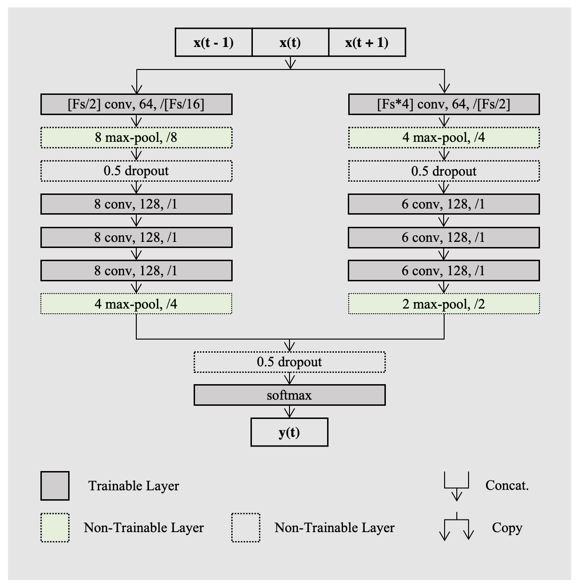

# DeepSleepNet-Lite

Implementation of *DeepSleepNet-Lite* [[1]](#dsnl) model for sleep scoring.

## Contents

- [Overview](#overview)
- [Environment](#environment)
- [Dataset](#dataset)
- [Training](#training)
- [Prediction](#prediction)
- [Summary](#summary)
- [References](#references)


## Overview

In this document we report the implementation of the official *DeepSleepNet-Lite* [[1]](#dsnl) model published in 
IEEE transactions on neural systems and rehabilitation engineering journal. *DeepSleepNet-Lite* is a simplified 
and lightweight scoring architecture, processing only 90-seconds EEG input sequences. We exploit the Monte Carlo 
dropout technique to enhance the performance of the architecture. The evaluation is performed on a single-channel 
EEG Fpz-Cz from the open source Sleep-EDF expanded database. DeepSleepNet-Lite achieves slightly lower performance, 
if not on par, compared to the existing state-of-the-art architectures, in overall accuracy, macro F1-score and 
Cohen’s kappa.

The architecture of *DeepSleepNet-Lite* is strongly inspired by *DeepSleepNet-Lite* from Supratak [[2]](#dsn). 
Unlike the original network, we have employed only the first representation learning part, and trained it 
with a sequence-to-epoch learning approach. The architecture receives in input a sequence of PSG epochs, and 
predicts the corresponding target of the central epoch of the sequence. 

The architecture of *DeepSleepNet-Lite*:


NOTE: Fs is the sampling rate of the EEG signals in input.

## Environment

The following setup has been used to reproduce this work.

On a Linux machine (Ubuntu 20.04.3 LTS) with at least 1 CUDA enabled GPU available and 
`anaconda` or `miniconda` installed, run the following two commands to create a conda environment named `dsnl_env`:

(NVIDIA-SMI 470.141.03  Driver Version: 470.141.03   CUDA Version: 11.4)

```
conda env create -f environment_dsnl.yml
conda activate dsnl_env
```


## Dataset

To facilitate the comparison with many existing deep learning based scoring algorithms, in this implementation we use 
both the previous uploaded version (v1) published in 2013 and the latest expanded version (v2) published in 2018 
of the [Sleep-EDF](https://www.physionet.org/content/sleep-edfx/1.0.0/) database. 

 In many recordings there were long wake periods before the patients went to sleep and after they woke up. 
 We have done experiments with the two common ways these periods are trimmed in literature: 
1) only in-bed parts are employed, i.e. from light-off time to light-on time, which we will refer to with v#-trim.
2) 30-minutes of data before and after in-bed parts are taken into account in the experiments, which we will refer 
to with v#.

We have used the EEG Fpz-Cz channel, with a sampling rate of 100 Hz and without any pre-processing.

We provide in [data.zip](https://drive.google.com/file/d/1wDu9tl6_P250k522tQC9LUUVh7ocG1_x/view?usp=sharing/) 
file all the recordings of both the versions v1 and v2, extracted using the two different trims. make sure to extract 
the zipped data file, and to move it in the main project directory DeepSleepNet-Lite as follows:

```
└─ deepsleepnet-lite-main
   ├─ data
      ├─ cpd
      ├─ eeg_FpzCz_PzOz_v1
      ├─ eeg_FpzCz_PzOz_v2
      ├─ data_split_v1
      ├─ data_split_v2
      
```

The validation procedure and the data-split is in line with the state-of-the-art methods. 
In fact, we evaluate our model using the k -fold cross-validation scheme. We set k equal to 20 for v1-2013 and 
10 for v2-2018 Sleep-EDF datasets. 

The *cpd* folder contains the conditional probability distribution (computed as described in [[1]](#dsnl)) 
over the five sleep stages for all the sequences of sleep epochs.

## Training

Run this script to train the *DeepSleepNet-Lite* **base** model on the version v1-2013 of the Sleep-EDF dataset
for the first fold of the 20-fold cross-validation.

    python train.py --data_dir data/SleepEDF/processed/eeg_FpzCz_PzOz_v1 --output_dir output/model/v1/base --n_folds 20 --fold_idx 0 --train_epochs 100 --smooth_value 0 --smooth_stats=False --resume=False

To evaluate the overall performance of the model, you have to train the *DeepSleepNet-Lite* model for every 
fold (i.e., `fold_idx=0...19`). Run the following script to run batch training on the different experimented models.

**base** model:

    chmod +x batch_train.sh
    ./batch_train.sh data/eeg_FpzCz_PzOz_v1/ output/model/v1/base 20 0 19 0 False False 0

**base+LSu** (label smoothing with the uniform distribution) model:

    chmod +x batch_train.sh
    ./batch_train.sh data/eeg_FpzCz_PzOz_v1/ output/model/v1/smoothing_uniform 20 0 19 0.1 False False 0

**base+LSs** (label smoothing with the conditional probability distribution) model: 

    chmod +x batch_train.sh
    ./batch_train.sh data/eeg_FpzCz_PzOz_v1/ output/model/v1/smoothing_stats 20 0 19 0.1 True False 0

#### Pre-trained *DeepSleepNet-Lite* models 

We provide in [model.zip](https://drive.google.com/file/d/112_uxXTtAC-LGoFERAyAOd6IqxqHwc4p/view?usp=sharing) 
file all the pre-trained models on both the versions v1 and v2, using the two different trims.  

## Prediction

Run this script to output the sleep stages predicted by the model for the recordings 
of the test-set subject/s of each cross-validation fold (e.g. with the **base** on v1).
The outputs will be stored in numpy files.

    python predict.py --data_dir data/SleepEDF/processed/eeg_FpzCz_PzOz_v1 --model_dir output/model/v1/base --output_dir output/results/v1/base

NOTE: If you want to predict by using the Monte-Carlo dropout (N=30 different predictions) run the following script:

    python predict.py --data_dir data/SleepEDF/processed/eeg_FpzCz_PzOz_v1 --model_dir output/model/v1/base --output_dir output/results/v1/base/MC30 --MC_dropout=True --MC_sampling 30

#### Results on the uploaded Pre-trained *DeepSleepNet-Lite* models 

We provide in [results.zip](https://drive.google.com/file/d/1SRCi8nsPlEww3yLqeEfhXVqsXyCOGHof/view?usp=sharing) 
file all the results on the pre-trained models on both the versions v1 and v2, using the two different trims.  

## Summary

Run this script to show a summary of the performance, calibration measures, confidence values, 
percentage of misclassified epochs detected by using the mu-query-procedure 
of all the *DeepSleepNet-Lite* models 
(e.g. **base** model on v1).

    python summary_muquery.py --data_dir output/results_repo/v1/base

## References

#### <a name="dsnl"> [1] DeepSleepNet-Lite

```
@article{fiorillo2021deepsleepnet,
  title={Deepsleepnet-lite: A simplified automatic sleep stage scoring model with uncertainty estimates},
  author={Fiorillo, Luigi and Favaro, Paolo and Faraci, Francesca Dalia},
  journal={IEEE transactions on neural systems and rehabilitation engineering},
  volume={29},
  pages={2076--2085},
  year={2021},
  publisher={IEEE}
}
```

#### <a name="dsn"> [1] DeepSleepNet

```
@article{supratak2017deepsleepnet,
  title={DeepSleepNet: A model for automatic sleep stage scoring based on raw single-channel EEG},
  author={Supratak, Akara and Dong, Hao and Wu, Chao and Guo, Yike},
  journal={IEEE Transactions on Neural Systems and Rehabilitation Engineering},
  volume={25},
  number={11},
  pages={1998--2008},
  year={2017},
  publisher={IEEE}
}
```
